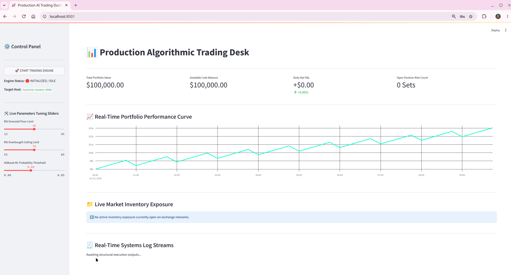

# AI-Driven Algorithmic Trading Microservices Architecture


A highly scalable, low-latency, containerized algorithmic trading framework built using a decoupled microservices mesh network topology. 

The architecture segregates core asynchronous market data streaming and order routing blocks from the analytics visual workspace. This design mirrors modern institutional quantitative trading desks, delivering thread-safe memory synchronization, pre-trade risk circuit breaking, non-blocking asynchronous data logging, and hot-reloaded development modules.

---
# AI-Driven Algorithmic Trading Microservices Architecture


<!-- 🚀 NEW GRAPHICAL PREVIEW COMPONENT INJECTED: -->


A highly scalable, low-latency, containerized algorithmic trading framework built using a decoupled microservices mesh network topology. 


## 🏗️ Core System Microservices Topology

The infrastructure runs inside an isolated internal Docker bridge network mesh, segregating operations into single-responsibility container layers:

```text
 ┌──────────────────────────────────────┐          ┌──────────────────────────────────────┐
 │             DASHBOARD-UI             │          │            BACKEND-DAEMON            │
 │   Streamlit Secure Analytics Desk    │          │      FastAPI / Asyncio Engine        │
 ├──────────────────────────────────────┤          ├──────────────────────────────────────┤
 │ - Secure Admin Credential Lock Gate │  HTTP    │ - Real-Time Websocket Ingestion      │
 │ - Live Interactive Plotly Curves     │ ───────► │ - XGBoost ML Inference Scoring Engine│
 │ - Parameters Tuning Sliders Sync     │ ◄─────── │ - Asynchronous SQLite Data Ledger    │
 └──────────────────────────────────────┘   JSON   └──────────────────────────────────────┘
```

1. **`backend-daemon`** (`FastAPI` & `Uvicorn`): Operates as a non-blocking background thread worker loop. It establishes low-latency WebSocket connections to the broker exchange, performs live technical indicator engineering, evaluates machine learning model probabilities, filters trade commands against pre-trade risk guards, and posts asynchronous execution updates to a local persistent SQLite ledger database volume.
2. **`dashboard-ui`** (`Streamlit` & `Plotly`): Serves as a high-performance visual workspace. It is wrapped inside an HTTP Basic Authentication gateway layer (`admin` / `QuantTrading2026!`), tracks active position exposure arrays, exposes dynamic hardware-style start/stop engine switches, embeds interactive line graph visual charts, and contains dynamic tuning input sliders that update the running backend parameters instantly in active memory without requiring service restarts.

---

## 🚀 Existing Features Matrix (Implemented Up to Now)

* **Pure Python Quantitative Stack**: Employs `pandas-ta-classic` to calculate core indicators (RSI, Moving Averages, MACD, Bollinger Bands) entirely in native Python, entirely bypassing heavy, brittle C-library binary compiler setup phases.
* **XGBoost Alpha Classification Engine**: Features a serialized out-of-sample machine learning model vector weights file (`xgboost_v1.pkl`). The live inference client dynamically maps indicators to the model's precise shape requirements to calculate upcoming upward directional probabilities.
* **Asynchronous Storage Data Ledger**: Includes an asynchronous non-blocking relational SQLite storage layer using `aiosqlite`. It executes fire-and-forget disk writes to save incoming data ticks and filled order receipts directly to a persistent local Docker storage volume without slowing down real-time ingestion tasks.
* **Pre-Trade Risk Circuit Breakers**: Protects capital allocations by screening all strategy signals against an inline `RiskManager` module before orders reach the broker client network. Enforces maximum per-trade allocations (2.0%), absolute daily account drawdown caps (5.0%), and manages a stateful **Dynamic Trailing Stop-Loss** floor.
* **Event-Driven Backtest Sandbox & Grid Search Optimizer**: Built-in quantitative backtester (`research/backtester.py`) that steps bar-by-bar through historical charts to calculate annualized Sharpe Ratios and Max Peak Drawdown curves while preventing look-ahead bias. Includes a parameter optimization script (`optimize_parameters.py`) that executes multi-variable search matrices over correlated data grids to reveal setup configurations that maximize returns.
* **Zero-Rebuild Development Hot-Reloading**: Configured using Docker Compose folder bind mounts (`- .:/app`). You can fine-tune strategy formulas or adjust metrics displays inside your local PyCharm workspace, and updates instantly reflect inside the running Linux containers.
* **Automated CI/CD Delivery Pipeline & Kubernetes Readiness**: Backed by a full integration testing suite module (`tests/test_integration_mesh.py`) running via `pytest` and `pytest-asyncio`. The configuration triggers a **GitHub Actions workflow pipeline** to run tests and tag clean Docker builds on every single code commit. Production deployment deployment sheets include automated self-healing orchestration probes (`/healthz` and `/readyz`) and hide sensitive brokerage tokens using native encrypted **Kubernetes Secrets**.

---

## 📁 Repository Directory Structure

```text
trading_system_prototype/
│
├── .github/workflows/
│   └── pipeline.yml          # Automated CI/CD GitHub Actions pipeline yml
│
├── config/
│   └── settings.py           # Pydantic-Settings environment validation mapper
│
├── core/
│   ├── broker_client.py      # Async WebSockets stream client & REST order manager
│   ├── database.py           # Asynchronous non-blocking SQLite database driver
│   ├── order_manager.py      # Transaction coordination ledger & state tracking
│   ├── risk_manager.py       # Pre-trade circuit breakers & trailing stop-loss
│   └── state_manager.py      # Thread-safe in-memory global telemetry cache
│
├── dashboard/
│   └── app.py                # Streamlit dark-mode secured visual analytics desk
│
├── deploy/
│   ├── backend-deployment.yaml # Kubernetes Pod orchestration configuration sheets
│   └── secrets.yaml          # Encrypted Base64 brokerage API credential layouts
│
├── logs/                     # Persistent Docker volume mount (Shared logs & database)
│   └── trading_data.db       # SQLite local database binary volume file
│
├── ml_pipeline/
│   ├── inference_engine.py   # Vector slicing shape alignment ML inference execution
│   ├── model_trainer.py      # Core XGBoost machine learning model trainer compiler
│   └── models/               # Serialized model binaries (.pkl storage)
│
├── research/
│   ├── backtester.py         # Event-driven historical market simulation sandbox
│   ├── optimization_records/ # Historical optimization search trace outputs
│   ├── performance_metrics.py# Vectorized Sharpe Ratio and Peak Drawdown formulas
│   └── query_db.py           # Containerized SQLite database utility audit tool
│
├── tests/
│   └── test_integration_mesh.py # Async integration pytest framework package
│
├── Dockerfile.backend        # Production multi-stage backend daemon image
├── Dockerfile.dashboard      # Production front-end web dashboard image wheel
└── docker-compose.yml        # Zero-rebuild dev grid with live hot-reloading
```

---

## 🛠️ Step-by-Step Local Execution Guide

Follow these sequential terminal commands inside your openSUSE workstation terminal to run, test, and audit your platform environment loops:

### 1. Launch the Development Microservices Mesh Network
```bash
# Clean out legacy hanging network endpoints and spin up the hot-reloaded development cluster
docker compose down
docker compose up -d

# Verify that both containers are actively 'Up' and mapping connection ports cleanly
docker compose ps
```
Visit **`http://localhost:8501`** in your browser and enter credentials (`admin` / `QuantTrading2026!`) to open your trading desk panel.

### 2. Stream Real-Time Logging Context and ML Inferences
```bash
# Monitor background process task loops, FastAPI requests, and WebSocket bar tick data inputs
docker compose logs -f backend-daemon
```

### 3. Execute the Automated Integration Testing Suite
```bash
# Bind your python path context and execute the asynchronous test pipeline locally on your host
export PYTHONPATH=$PWD
pytest -v tests/
```

### 4. Execute Multi-Variable Parameters Grid Search Optimizations
```bash
# Run historical grid parameter optimization over your mathematical correlated charts 
python optimize_parameters.py
```

### 5. Run the Containerized Database Audit Tool
```bash
# Query your persistent SQLite storage tables to review total ticks counts and filled receipt ledgers
docker compose exec -e PYTHONPATH=/app backend-daemon python research/query_db.py
```

---

## 🔮 Strategic Feature Upgrade Proposals (Future Roadmap)

To expand this framework into an institutional-grade algorithmic execution platform, the following architectural enhancements are proposed:

### 🚀 1. Realized Profit and Loss (P&L) Ledger Audit Aggregator
* **Objective**: Introduce tracking for *realized* P&L by computing transaction offsets immediately upon position liquidation actions.
* **Implementation**: Expand the database manager layer (`core/database.py`) to process closed trades. Add color-coded indicators (Green for profitable executions, Red for losing metrics) inside the open inventory data tables on your Streamlit client viewport.

